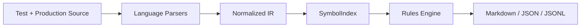

<div align="center">

# Momus-MCP

**The ultimate critic among the deities, pointed at your test suite.**

[](https://github.com/AraneaDev/Momus-MCP/releases)
[](https://github.com/AraneaDev/Momus-MCP/actions/workflows/ci.yml)
[](https://github.com/AraneaDev/Momus-MCP/actions/workflows/ci.yml)
[](./LICENSE)
[](https://github.com/AraneaDev/Momus-MCP)
[](https://github.com/AraneaDev/Momus-MCP/commits/main)
[](https://www.conventionalcommits.org/)
[](https://mcpobservatory.com/servers/github:AraneaDev/Momus-MCP/security)
[](#quick-start)

</div>

> **Momus** (Μῶμος) is the ancient Greek spirit and personification of **satire, mockery,
> blame, and harsh criticism**. He is the one god whose entire job was to find fault, and who
> was finally thrown off Olympus for doing it too well. His name translates literally as
> **"blame"** or **"censure"**.

Momus-MCP is a **local-first, deterministic, read-only** MCP server and CLI that audits test
suites the way Momus audited the gods: ruthlessly, and with no tolerance for things that pass
while proving nothing. It hunts **false-green tests**, suites that go green because of
tautological assertions, mock-contract drift, and mock-hygiene problems rather than because the
code works. The name is doubly apt: Momus is the god of *mockery*, and mock objects are exactly
what this tool scrutinises.

> **Status:** pre-release. Momus-MCP is **not yet published to npm**. The publish step in the
> release workflow is deliberately dormant (credential-blocked). The source is public, so
> install from source (see [Quick start](#quick-start)). Any `npx @momus/*` command you find
> elsewhere will not resolve until the packages are published.

---

## Why Momus-MCP?

Coding agents are great at writing tests. They are also great at writing tests that can never
fail: asserting a mock's own configured return value, stubbing a method that no longer exists,
or comparing a value with itself. The result is a suite that is green and useless.

Momus-MCP statically detects these. It never executes your code, never talks to the network, and
never writes to your workspace. It just reads the source, builds a symbol graph of your
production code, and checks every mock, spy, and assertion against it.

### Relentless detection

| Category | Rules | What it catches |
|---|---|---|
| **Tautological assertions** | `TAUT-001…006` | self-comparison, mock-echo (asserting a stub's own return), constant-tautology, mock-only assertions, zero-reach stubs, unconfigured-spy assertions |
| **Mock-contract drift** | `DRIFT-000…006` | unresolvable targets, missing members, signature mismatches, return-type mismatches, constructor drift, missing exports, stale mocks (git-diff aware) |
| **Mock hygiene** | `MOCK-001/002` | over-mocking (saturation), mocking the module under test |

### Deterministic by contract

- **Read-only**: every tool is annotated `readOnlyHint: true, destructiveHint: false`.
- **Deterministic**: byte-identical output for an identical workspace (golden-tested).
- **Token-budgeted**: every finding renders in **< 100 tokens** (unit-tested).
- **Zero false positives on the reference healthy suite**: anti-pattern fixtures ship with a
  healthy twin, and both are asserted in CI.
- **Zero runtime dependencies in `@momus/core`**: the engine is pure TypeScript.

### Four languages, one engine

- **TypeScript / JavaScript**: Vitest and Jest (`vi.mock`, `vi.fn`, `vi.spyOn`, `vi.mocked`,
  `jest.mock`, object-literal and Proxy doubles, automock helpers).
- **PHP**: PHPUnit, Pest, and Mockery (`createMock`, `getMockForAbstractClass`, `mock()`,
  `Mockery::mock`, closure-form mocks, docblock `@param`/`@return` typing, Composer PSR-4 and
  classmap resolution).
- **Python**: pytest and unittest (`patch`, `patch.object`, `Mock(spec=)`, `mocker`,
  `monkeypatch`, `assert`/`pytest.raises`), PEP 484/526/585/604 annotation typing (opt-in via
  `languages.python`).
- **Rust**: `mockall` (`#[automock]`, `mock!`, `expect_*().returning()`), `mockito`,
  `wiremock`, and built-in `assert!`/`assert_eq!`/`assert_ne!`/`assert_matches!`, via a `syn`-to-
  WASM parser with a crate-wide index for semantic-from-day-one drift checking (opt-in via
  `languages.rust`).

---

## Quick start

Requirements: **Node.js ≥ 20**.

```bash
git clone <this repository>
cd momus-mcp
npm ci
npx momus audit .
```

Momus exits with:

| Code | Meaning |
|---|---|
| `0` | no error-level findings |
| `1` | error-level findings present |
| `2` | usage or configuration error |
| `3` | unexpected internal error |

Once published, the same experience is a one-liner:

```bash
npx momus audit .            # Markdown report; exit 1 on errors
npx momus audit . --json     # machine-readable JSON envelope
```

### Useful commands

```bash
npx momus audit .                        # full audit (tautology + drift + hygiene)
npx momus audit tests/order.test.ts      # scope to specific paths
npx momus drift                          # mock-contract drift only
npx momus precommit                      # drift on uncommitted changes (git-diff scope)
npx momus hook --install --yes           # install the pre-commit drift gate
npx momus annotate                       # JSONL findings for editor plugins
npx momus contract src/services/ledger.ts  # synthesize a strict mock from a real class
npx momus rules                          # list rules and severities
npx momus init                           # scaffold a .momusrc config
npx momus doctor                         # inspect the local setup
npx momus serve                          # run the MCP server (stdio)
npx momus serve --transport http --port 3000  # Streamable HTTP transport
npx momus serve --watch                  # re-audit on file changes (chokidar)
```

---

## MCP server

Momus speaks stdio (default) or Streamable HTTP, and is read-only. Point it at a workspace with
`MOMUS_ROOT`.

### Claude Desktop

```json
{
  "mcpServers": {
    "momus": {
      "command": "npx",
      "args": ["-y", "@momus/mcp-server"],
      "env": {
        "MOMUS_ROOT": "/absolute/path/to/your/project"
      }
    }
  }
}
```

### Cursor and other MCP clients

The same shape works in any MCP client:

```json
{
  "command": "npx",
  "args": ["-y", "@momus/mcp-server"],
  "env": {
    "MOMUS_ROOT": "/absolute/path/to/your/project"
  }
}
```

### Tools

| Tool | What it does |
|---|---|
| `audit_test_fidelity` | Deep audit of a test file: every mock/spy/stub checked against its real production dependency |
| `detect_tautological_assertions` | Find assertions that cannot fail |
| `verify_mock_drift` | Find test doubles that no longer match production (supports `scope: git-diff`) |
| `synthesize_mock_contract` | Generate a strict typed mock template from a real class/interface |
| `list_rules` | The rule catalog with severities |

---

## Use cases

- **Agent guardrails**: drop Momus into a coding agent's loop and block it from committing a
  test that "passes" by echoing the mock it just configured.
- **Pre-commit drift gate**: `momus hook --install` (or `precommit` in CI) fails the commit the
  moment a production rename leaves a test double behind.
- **Mock-contract generation**: point `synthesize_mock_contract` at a class and get a typed,
  `satisfies Partial<T>` template instead of hand-writing `as any` stubs.
- **PHP parity**: the same rules for PHPUnit/Pest suites, including constructor drift and
  docblock-typed returns.

---

## How it works



1. **Discover** source and test files (capped, gitignore-aware).
2. **Parse** each file into a language-neutral IR (TypeScript via the compiler API, PHP via
   `php-parser`). A persistent `better-sqlite3` cache keyed by content hash + workspace digest
   makes warm audits fast.
3. **Index** production symbols into a graph of classes, interfaces, members, and signatures.
4. **Run rules**: every mock and assertion is checked against the real production contract;
   findings are suppression-aware and rendered under a token budget.
5. **Report**: Markdown, a JSON envelope, or JSONL for editor plugins, with honest exit codes.

---

## Configuration

Momus reads `.momusrc` from the workspace root. `npx momus init` scaffolds one:

```jsonc
{
  "languages": { "typescript": true, "php": false },
  "testFilePatterns": ["**/*.{test,spec}.{ts,tsx,js,jsx,mjs}", "**/__tests__/**"],
  "ignorePatterns": ["**/node_modules/**", "**/dist/**", "**/.git/**"],
  "rules": {
    "TAUT-002": { "severity": "error" }
  },
  "tokenBudget": { "maxIssuesPerReport": 50, "maxIssueLineTokens": 100 },
  "cache": { "dir": ".momus/cache", "enabled": true }
}
```

Intentional exceptions are marked in source:

```ts
// @momus-ignore:TAUT-002
expect(result).toEqual(configuredValue);
```

See the specification for the complete suppression grammar (`line`, trailing, docblock,
file-banner) and the full configuration schema (`schemas/momusrc.schema.json`).

---

## Documentation hub

| Document | Contents |
|---|---|
| [`docs/README.md`](docs/README.md) | Specification index and project status |
| [`docs/02-architecture.md`](docs/02-architecture.md) | Parsing strategy, IR, symbol index, mock catalog |
| [`docs/03-analysis-algorithms.md`](docs/03-analysis-algorithms.md) | Rule catalog and detection algorithms |
| [`docs/04-mcp-tool-definitions.md`](docs/04-mcp-tool-definitions.md) | MCP tool schemas and agent protocol |
| [`docs/05-output-format.md`](docs/05-output-format.md) | Issue grammar and Markdown/JSON schemas |
| [`docs/10-build-plan.md`](docs/10-build-plan.md) | Implementation status and sequenced plan |
| [`HANDOVER.md`](HANDOVER.md) | Current engineering handover |

---

## Development

```bash
npm ci
npm run typecheck     # 0 errors across all packages
npm test              # vitest: unit + integration + golden suites
npm run test:coverage # v8 coverage with floors (80% stmts/lines, 75% branches, 90% funcs)
npm run lint          # ESLint (flat config, typescript-eslint)
npm run format:check  # Prettier
npm run audit-self    # Momus audits its own repo, must stay CLEAN
```

The repository is an npm workspace. Package sources run directly from TypeScript during this
pre-publish phase; `npx momus` resolves through the workspace bin after `npm ci`.

## License

Released under the **MIT License**, free for any use, commercial included. It speaks any MCP
client, not just Claude Code, and reads code you already have. Like its namesake, it will tell
you exactly what is wrong. Politely is not in the job description.
